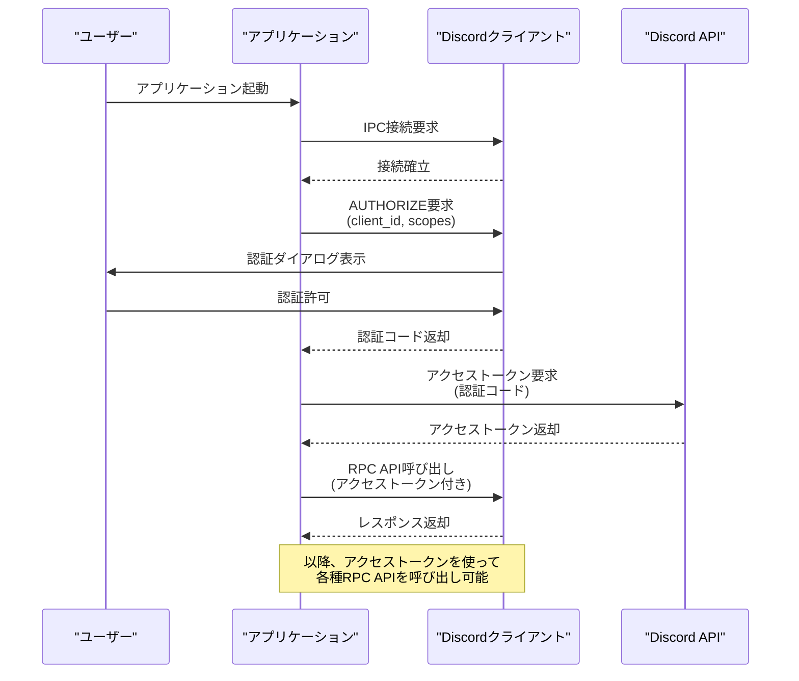

# はじめに

**「DiscordのBotは、Botが参加しているサーバーのメッセージしか取得できない」**

とずっと思っていました。  
でも、見つけてしまいました。Discordには「RPC API」というユーザーアカウントを制御できるAPIが存在するのです。  

これを使えば自分のDMの取得を自動で行うことが出来ます。  
もちろん、セルフBOTなどの非公式APIではありません。(ちゃんと[公式ドキュメント](https://discord.com/developers/docs/topics/rpc)があります)

この記事では、RPC APIでできること及び使い方の紹介と、それを使って「Cursorでの返答生成を補助するツール」を作った話をします。

## Discord RPC APIとは？

ゲームからDiscordクライアントを操作するAPIです。

このAPIを使っている有名なツールとして、OBSにVCの様子をオーバーレイできる「[Discord StreamKit Overlay](https://streamkit.discord.com/overlay)」という公式ツールがあります。

「Discord RPC」と検索して引っかかる「[Rich Presence](https://discord.com/developers/docs/rich-presence/overview)」というゲーム情報をプロフィールに表示する機能もRPC APIの機能の一つです。  

### RPC APIでできること

RPC APIを使うと、以下の機能にアクセスできます：

- 📝 **メッセージの取得・送信** - DMやサーバーチャットの履歴を取得 (最新50件まで)、通知の取得
- 🎯 **クライアント操作** - テキストチャンネルの選択、VCへの参加/切断
- 👥 **情報取得** - サーバーリストや、VCのメンバーを取得
- 🔊 **音声設定変更** - マイクやスピーカーの音量調整/設定取得、個別ユーザーの音量/パンの調整
- 🎮 **アクティビティ情報** - ゲームへの参加リクエストを送る

特に注目すべきは、**DMのメッセージを取得**できることです。これは通常のBot APIでは実現が困難です。

### プライベートβ機能です

RPC APIは現在プライベートβ段階にあります。なので機能を公開してみんなに使ってもらうことはできません。  
しかし、**自分だけが使用する分には誰でも利用可能**です。  
[Discord Developer Portal](https://discord.com/developers/applications)でアプリケーションを作成するだけで、すぐに試すことができます。

## RPC APIを使うための認可フロー

RPC APIを使用するための認証・通信フローは以下のようになります：



重要なポイントは、Discordバックエンドとではなく**Discordデスクトップクライアントと通信している**ことです。  
なのでWebブラウザやモバイルアプリでは動作しません。

## 実際に使うための技術的な準備

### 1. Discord Developer Portalでの設定

まず、[Discord Developer Portal](https://discord.com/developers/applications)でアプリケーションを作成します：

1. 「New Application」でアプリケーションを作成
2. 「OAuth2」タブを開く
3. Client IDとClient Secretを取得
4. **重要**: Redirectsに `http://localhost` を追加

### 2. Node.jsとdiscord-rpcライブラリのインストール

1. Node.js環境がない場合は、[Node.js](https://nodejs.org/)をインストールする。
2. ターミナルで以下のコマンドを実行して、[discord-rpc](https://www.npmjs.com/package/discord-rpc)ライブラリをインストールする。
    ```cmd
    npm install discord-rpc
    ```

### 3. 認証の実装

RPC APIの認証は[discord-rpc](https://www.npmjs.com/package/discord-rpc)ライブラリを使えば非常にシンプルです。重要なのは以下の2点です：

#### transport設定は必ず'ipc'を使用

```javascript
import { Client } from 'discord-rpc';

const client = new Client({
    transport: 'ipc', // 必須！websocketは使用不可
});
```

**なぜwebsocketが使えないのか？**  
WebSocketを使用する場合、Discord Developer Portalで自分のドメインを登録する必要があります。  
しかし、RPC APIはプライベートβ版のため、その設定画面が提供されていません。そのため、IPCを使った接続のみが利用可能です。

#### 認証方法

**初回認証（認証画面が表示される）：**

```javascript
const clientId = 'あなたのクライアントID';
const clientSecret = 'あなたのクライアントシークレット';
const scopes = ['rpc', 'messages.read'];

await client.login({
    clientId,
    clientSecret,
    redirectUri: 'http://localhost',
    scopes,
});

// 認証完了後、client.accessTokenでアクセストークンを取得できます
console.log('アクセストークン:', client.accessToken);
```


**補足：保存したアクセストークンでの再認証**

一度取得したアクセストークンは保存しておくことで、次回から認証画面を表示せずにログインできます：

```javascript
// 保存されたアクセストークンを使用
const savedAccessToken = 'previously_obtained_access_token';

await client.login({
    clientId,
    scopes,
    accessToken: savedAccessToken, // clientSecretの代わりにaccessTokenを指定
});
```

#### 接続完了の処理

認証が完了すると`ready`イベントが発火します。実際のRPC API操作は、このイベント内で行いましょう：

```javascript
// 接続完了時のイベント
client.on('ready', async () => {
    console.log('接続完了！');
    console.log('アプリケーション名:', client.application.name);
    console.log('連携ユーザー名:', client.user.username);
    
    // アクセストークンを保存（次回の認証画面スキップ用）
    const accessToken = client.accessToken;
    // ここでlocalStorageやファイルに保存
    
    // ここから `await client.getChannel('チャンネルID')` などのRPC API操作が可能
});
```

これで`client.getChannel()`、`client.getVoiceChannels()`などの様々なRPC API機能にアクセスできるようになります。

#### 💡 デバッグの便利Tips

VSCodeやCursorで開発する際は、`ready`イベント内にブレークポイントを置いて、デバッグコンソールからRPC APIを試すことができます：

1. `ready`イベント内にブレークポイントを設置
2. デバッグコンソールで `myClient = client` を実行
3. ブレークポイントを再開
4. デバッグコンソールで `await myClient.getChannel('チャンネルID')` などを試行

これにより、コードを書かずにRPC APIの動作を確認できます。

## メッセージ取得ツールの作成

RPC APIを応用して、**RPC APIでメッセージを取得し、Cursorに読み込ませて適切な返答を生成させる**ツールを作ってみました。


https://github.com/Kamesuta/discord-rpc-message-fetcher

### 主な機能

1. **テキストファイルとして出力** - 最新50件のメッセージをテキスト形式で保存。テキスト形式なのでCursorで直接読み込める。
2. **インタラクティブなTUI** - チャンネルIDを入力してEnterを押すだけでメッセージ取得。その後はEnterキーで何度でも再取得可能。

## 注意点と制限事項

### 技術的制限
- **Discordデスクトップアプリ必須** - Web版では動作しない。
- **プライベートβ** - 現在は自分だけの利用のみ。公開はできない。
- **メッセージ数制限** - 一度に取得できるのは最大50件。

### 気をつけたいこと
- アクセストークンをGitにアップしないこと。
- APIの悪用厳禁。
- Discordの利用規約の遵守すること。

## まとめ

Discord RPC APIを使えばBotでは出来なかったユーザーの操作が可能で、いろんなことに使えそうです。

今回のツールの他にも、以下のようなツールを作ってみてはいかがでしょうか？
- 音声やPanを調整し、近くにいるひととだけとだけ喋れるゲームの作成
- 好きな人がVCに入ったら速攻でそのVCに参加するツールの作成
- 自分の名前が呼ばれたらそのチャンネルを開くアプリの作成

## 参考リンク

- [Discord Developer Portal](https://discord.com/developers/docs/topics/rpc)
- [discord-rpc npm package](https://www.npmjs.com/package/discord-rpc)
